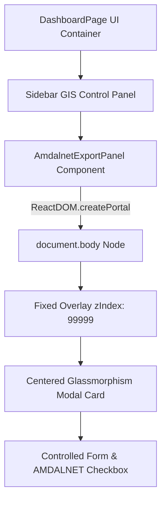
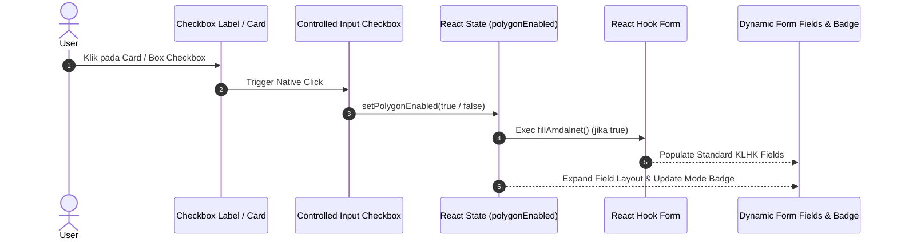

# 📐 Analisis Arsitektur & Spesifikasi Card Form Metadata Polygon & AMDALNET

Dokumen ini berisi analisis komprehensif mengenai perancangan, arsitektur state management, perbaikan komponen controlled checkbox, serta integrasi ekspor GIS untuk **AmdalnetExportPanel** pada aplikasi **BikinPolygon GIS Workspace**.

---

## 1. 📌 Ringkasan Eksekutif

Modal **Form Metadata Polygon** (`AmdalnetExportPanel`) bertindak sebagai gerbang utama (*Export Dock*) untuk menangkap metadata subjek hukum (Pemohon/Pemrakarsa), bidang usaha (Kegiatan), dan atribut spasial standar **Kementerian Lingkungan Hidup dan Kehutanan (KLHK)** serta **OSS RBA**.

Komponen ini dirancang secara dinamis menggunakan dua mode ekspor:
1. **Mode Polygon Biasa (OSS RBA / General GIS)**: Hanya membutuhkan nama pemohon dan jenis kegiatan usaha (WGS84 EPSG:4326).
2. **Mode AMDALNET KLHK (Peta Tapak Proyek)**: Mengaktifkan 8 kolom atribut wajib DBF standar KLHK (Web Mercator EPSG:3857 / UTM Zone).

---

## 2. 🏗️ Arsitektur Stacking Context & Portal Rendering

Untuk mencegah kendala *stacking context* dan pembatalan event klik (*event-clipping*) dari container sidebar React, modal ini dirender menggunakan **`ReactDOM.createPortal`** langsung ke `document.body`.



### Karakteristik Desain Modal Card:
- **Root Element**: `ReactDOM.createPortal(..., document.body)`
- **Z-Index Overlay**: `99999` (memastikan berada di atas peta Leaflet & sidebar).
- **Backdrop Blur**: `bg-black/80 backdrop-blur-md`
- **Isolation Event**: `onClick={(e) => e.stopPropagation()}` pada card container untuk mencegah modal tertutup secara tidak sengaja saat interaksi form.

---

## 3. 🔄 Diagram Alur State Controlled Component (`polygonEnabled`)

Pengubahan mode AMDALNET menggunakan React State murni (`polygonEnabled`) yang mematuhi pola *controlled component*.



### Logika React State Handler:
```jsx
// Declaration State Controlled Component
const [polygonEnabled, setPolygonEnabled] = useState(false);
const isAmdalMode = polygonEnabled;

// Toggle Handler Murni (Bebas Side-Effect di State Reducer)
const handleToggleAmdalMode = (enabled) => {
  const nextState = typeof enabled === 'boolean' ? enabled : !polygonEnabled;
  setPolygonEnabled(nextState);
  if (nextState) {
    fillAmdalnet();
  }
};
```

---

## 4. 📝 Analisis Field Form & Validasi Schema (Zod + React Hook Form)

Seluruh input dikelola oleh `react-hook-form` dengan resolver `@hookform/resolvers/zod`.

### Tabel Spesifikasi Field Form:

| Field Name | Type | Status (Standard) | Status (AMDALNET) | Batasan Karakter / Validasi | Default / Example Value |
| :--- | :--- | :--- | :--- | :--- | :--- |
| `PEMRAKARSA` | Text | **Wajib** | **Wajib** | Min 1, Max 100 char | `PT Sumber Alam Perdana` |
| `KEGIATAN` | Text | **Wajib** | **Wajib** | Min 1, Max 254 char | `Perdagangan Besar dan Eceran` |
| `TAHUN` | Number | Opsional | **Wajib** | Integer (1900 - 2100) | `2026` (Tahun Berjalan) |
| `PROVINSI` | Select/Text | Hidden | **Wajib** | String Max 50 char | `DKI JAKARTA` |
| `KOTA` | Select/Text | Hidden | **Wajib** | String Max 50 char | `KOTA ADM. JAKARTA SELATAN` |
| `KECAMATAN` | Select/Text | Hidden | **Wajib** | String Max 50 char | `KEBAYORAN BARU` |
| `ALAMAT` | Textarea | Hidden | **Wajib** | String Text | `Jl. Jendral Sudirman No. 45` |
| `KETERANGAN` | Textarea | Hidden | Opsional | Max 254 char | *Auto-generated gabungan lokasi* |

---

## 5. 📊 Tabel Perbandingan Mode Ekspor GIS (OSS vs AMDALNET)

| Fitur / Parameter | Mode Polygon Biasa (`polygonEnabled = false`) | Mode AMDALNET KLHK (`polygonEnabled = true`) |
| :--- | :--- | :--- |
| **Nama Zip File** | `Polygon_Lahan.zip` / `.pdf` | `Tapak_proyek.zip` / `.pdf` |
| **Nama Layer DBF** | `Polygon_Lahan` | `Tapak_proyek` |
| **Sistem Proyeksi Spasial** | WGS 1984 (`EPSG:4326`) | Web Mercator / Projected (`EPSG:3857`) |
| **Struktur Kolom DBF** | 5 Kolom: `PEMOHON`, `KEGIATAN`, `AREA_M2`, `AREA_HA`, `TANGGAL` | 8 Kolom KLHK: `OBJECTID_1`, `PEMRAKARSA`, `KEGIATAN`, `TAHUN`, `PROVINSI`, `KETERANGAN`, `LAYER`, `AREA` |
| **Isi File Archive Zip** | `.shp`, `.shx`, `.dbf`, `.prj`, `.cpg` | `.shp`, `.shx`, `.dbf`, `.prj`, `.cpg` |

---

## 6. 🗺️ Penanganan Reference System & Proyeksi GIS (PRJ & CPG)

### 1. WGS84 Reference (`Polygon_Lahan.prj`):
```text
GEOGCS["GCS_WGS_1984",DATUM["D_WGS_1984",SPHEROID["WGS_1984",6378137.0,298.257223563]],PRIMEM["Greenwich",0.0],UNIT["Degree",0.0174532925199433]]
```

### 2. AMDALNET Reference (`Tapak_proyek.prj`):
```text
PROJCS["WGS_1984_Web_Mercator_Auxiliary_Sphere",GEOGCS["GCS_WGS_1984",DATUM["D_WGS_1984",SPHEROID["WGS_1984",6378137.0,298.257223563]],PRIMEM["Greenwich",0.0],UNIT["Degree",0.0174532925199433]],PROJECTION["Mercator_Auxiliary_Sphere"],PARAMETER["False_Easting",0.0],PARAMETER["False_Northing",0.0],PARAMETER["Central_Meridian",0.0],PARAMETER["Standard_Parallel_1",0.0],PARAMETER["Auxiliary_Sphere_Type",0.0],UNIT["Meter",1.0]]
```

---

## 7. 🚀 Kesimpulan & Rekomendasi

1. **Perbaikan State Checkbox**: Penggunaan `polygonEnabled` sebagai *controlled state* React memastikan setiap klik pada card maupun checkbox mengubah state secara instan dan memicu render ulang layout form.
2. **Aksesibilitas Modal Card**: Penghapusan blocker pembuka modal awal menjamin pengguna dapat melihat form dan mencoba fitur "Isi Otomatis" AMDALNET sebelum menggambar polygon di peta.
3. **Kepatuhan Spasial KLHK**: Pemisahan mapper GeoJSON menjamin hasil unduhan file `.zip` 100% kompatibel saat diunggah ke portal resmi AMDALNET KLHK maupun OSS RBA.
