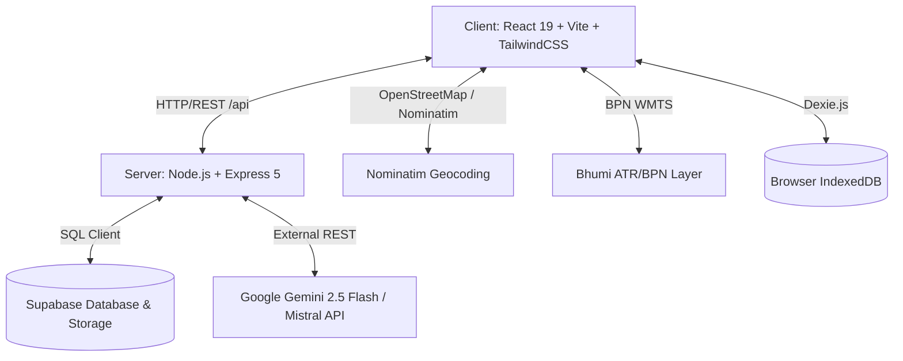

# 📊 Laporan Analisis Kode Menyeluruh: LineSima (Land Scaler System)

## 1. Ringkasan Eksekutif

**LineSima** adalah aplikasi web berbasis GIS (*Geographic Information System*) bertipe **Monorepo** yang dirancang untuk membantu pengusaha, konsultan lingkungan, dan pemohon perizinan dalam membuat **Polygon Shapefile (.shp)** yang valid sesuai standar **OSS RBA (Online Single Submission Risk-Based Approach)** dan **AMDALNET (Kementerian LHK)** Indonesia. 

Aplikasi ini menyertakan fitur digitasi peta interaktif berbasis satelit, ekspor shapefile ZIP, generator laporan geospasial berbasis PDF, modul integrasi skema data AMDALNET, sistem monetisasi berbasis token (kredit), panel administrasi (*Kelola*), serta engine pembuat konten SEO/AEO (*Answer Engine Optimization*) bertenaga AI (Google Gemini 2.5 Flash & Mistral AI).

---

## 2. Arsitektur & Teknologi yang Digunakan

Aplikasi diarsitektursikan menggunakan pola **Full-stack Node.js Monorepo** memanfaatkan fitur NPM Workspaces:



### Stack Teknologi:
* **Frontend (`/client`)**:
  * **Core**: React 19, Vite, React Router DOM v7, Context API.
  * **Peta & GIS**: Leaflet, React-Leaflet, Leaflet-Draw, `@turf/turf` (kalkulasi spasial luas/m² & hektar), `@mapbox/shp-write`.
  * **UI & Styling**: Tailwind CSS, Radix UI (Dialog, Label, Toast), Lucide React Icons.
  * **Form & Validasi**: React Hook Form, Zod.
  * **Dokumen & PDF**: `pdf-lib`, `dom-to-image-more`, `file-saver`.
  * **Client Caching**: `dexie` (IndexedDB untuk draft AEO & antrean blog).
* **Backend (`/server`)**:
  * **Runtime & Server**: Node.js, Express v5.
  * **Database & Auth**: Supabase Client (`@supabase/supabase-js`), `jsonwebtoken` (JWT), `bcryptjs`.
  * **Security**: `helmet` (Security Headers), `cors`, `express-rate-limit` (Multiple Limiter Tiers).
  * **File Processing & PDF**: `archiver` (ZIP stream), `pdfkit` (PDF Canvas & Vector Drawing).
* **Deployment & Proxy**:
  * Configured via `vercel.json` untuk *Serverless Node function* (`/api/(.*)`) & static SPA client.

---

## 3. Struktur Direktori & Fungsi Berkas

```
polygon/
├── package.json               # Konfigurasi Monorepo (Workspaces: client & server)
├── vercel.json                # Serverless build & proxy routing Vercel
├── parse_shp.js & parse_dbf.js # Script utility debugger format binary GIS Shapefile/DBF
├── debug_insert.js            # Script manual seed user ke Supabase
│
├── client/                    # Aplikasi Frontend (Vite + React)
│   ├── package.json           # Dependensi frontend & script runner
│   ├── index.html             # Entry point HTML & Meta SEO
│   ├── vite.config.js         # Konfigurasi Vite & Alias `@/`
│   └── src/
│       ├── main.jsx           # Mount root React ke DOM
│       ├── App.jsx            # Routing utama, PrivateRoute, AdminRoute
│       ├── db.js              # Schema Dexie.js (IndexedDB local store)
│       ├── context/
│       │   └── AuthContext.jsx # Management state login, token & user balance
│       ├── lib/
│       │   ├── api.js         # Instance Axios + Authorization Bearer Interceptor
│       │   └── supabase.js    # Client Supabase browser (dengan Mock Fallback)
│       ├── components/
│       │   ├── DigitasiMap.jsx        # Peta interaktif Leaflet + Leaflet-Draw + Basemap
│       │   ├── AmdalnetExportPanel.jsx# Form input & tombol export AMDALNET
│       │   ├── PaymentModal.jsx       # Modal top-up token
│       │   └── DisclaimerModal.jsx    # Modal konfirmasi disclaimer layer BPN
│       ├── modules/amdalnet/
│       │   ├── constants.js   # Konfigurasi PRJ (WGS84) & CPG encoding
│       │   ├── mapper.js      # Mapping GeoJSON ke atribut skema AMDALNET
│       │   ├── exporter.js    # Generator SHP ZIP AMDALNET via shp-write
│       │   ├── pdf-exporter.js# Generator PDF AMDALNET via pdf-lib
│       │   └── validation.js  # Schema Zod validasi form AMDALNET
│       └── pages/
│           ├── Landing.jsx    # Landing page publik + Sales Copywriting + FAQ
│           ├── Dashboard.jsx  # Main Workspace digitasi polygon & generator
│           ├── Kelola.jsx     # Dashboard Admin (User list, Token update, Activity Logs)
│           ├── AdminAEO.jsx   # Panel kontrol skenario AEO FAQ
│           └── BlogPost.jsx   # Dynamic renderer artikel blog SEO
│
└── server/                    # Backend API (Express.js)
    ├── package.json           # Dependensi server & runner nodemon
    ├── server.js              # Middlewares, Security Policy, Rate Limit, Router binding
    └── routes/
        ├── auth.js            # Register & Login User API
        ├── generator.js       # API SHP, PDF, Image Export & Proxy Tile Google Maps
        ├── kelola.js          # Admin Management API + AI Generator (Gemini & Mistral)
        └── aeo.js             # API CRUD scenario AEO OSS
```

---

## 4. Analisis Mendalam Komponen Backend

### A. Keamanan & Performa (`server.js` & `server/routes/kelola.js`)
1. **Multi-tier Rate Limiting**:
   * *Global Limiter*: Maksimal 100 request / 15 menit (Kecuali endpoint `/proxy-tile`).
   * *Auth Limiter*: Maksimal 5 percobaan login/register / 15 menit untuk mencegah *Brute Force*.
   * *Kelola Limiter*: Maksimal 30 request / 5 menit khusus untuk rute sensitif admin.
2. **Security Headers & Obfuscation**:
   * Rute admin diubah dari `/admin` menjadi `/kelola` untuk menghindari pemindaian otomatis (*bot scanner*).
   * Pola-pola URL mencurigakan seperti `/wp-admin`, `phpmyadmin`, `.env`, `.git` langsung diblokir (*Blocked Suspicious Request*).
   * Request ID otomatis dipasang via `crypto.randomUUID()` untuk *audit trail logging*.

### B. Otentikasi & Otorisasi (`server/routes/auth.js`)
* Pengguna mendaftar dengan *email, password, name, whatsapp*.
* Password di-hash menggunakan **Bcrypt** (salt factor 10).
* Login mengembalikan Token **JWT** berdurasi 1 hari.

### C. Backend Generator Geospasial (`server/routes/generator.js`)
* Endpoint `/create-pdf`: Menerima tangkapan layar peta (base64) + daftar koordinat (custom / manual). Menggunakan **PDFKit** untuk menggambar laporan landscape A4 yang bersih, lengkap dengan tabel titik koordinat Longitude/Latitude, status validasi WGS84, dan plotting polygon merah pada canvas PDF.
* Endpoint `/proxy-tile`: Berfungsi sebagai *Tile Proxy Server* untuk menyajikan Tile Google Maps (`mt1.google.com`) guna mengatasi kendala CORS (*Cross-Origin Resource Sharing*) pada peta frontend.

---

## 5. Analisis Mendalam Komponen Frontend

### A. Peta Interaktif & Digitasi Spasial (`client/src/components/DigitasiMap.jsx`)
* **Dual Layer Basemap**: Pengguna dapat beralih antara Google Satellite Tile dan Google Street Map.
* **Integrasi Layer BPN (Bhumi ATR/BPN)**: Menyajikan layer WMS (*Web Map Service*) dari peta bidang tanah pertanahan nasional lengkap dengan modal *disclaimer* teknis.
* **Kalkulasi Real-time dengan Turf.js**: Menghitung luas area secara otomatis baik dalam satuan Meter Persegi ($\text{m}^2$) maupun Hektar ($\text{Ha}$).
* **Dynamic Polygon Preview**: Jika pengguna memasukkan koordinat Latitude, Longitude, dan Luas secara manual di form, peta akan langsung memunculkan *Live Dashed Preview Box* lokasi polygon.

### B. Workspace Dashboard (`client/src/pages/Dashboard.jsx`)
* **Pencarian Lokasi (Geocoding)**: Terintegrasi dengan OpenStreetMap Nominatim API dengan mekanisme *fallback cleaning* (menghapus format RT/RW & Kode Pos jika pencarian awal tidak ditemukan).
* **Google Maps URL Parser**: Mengorientasikan koordinat secara otomatis dari URL Google Maps (`!3d`, `!4d`, `@lat,lng`).
* **Pengurang Balans Token Otomatis**: Setiap kali mengklik **File OSS** (5 Token) atau **Cetak PDF** (5 Token), saldo pengguna akan terpotong secara *real-time*.

---

## 6. Modul-Modul Spesifik & Fitur Utama

### 1. Modul Integrasi AMDALNET (`client/src/modules/amdalnet/`)
Dirancang khusus mengikuti spesifikasi standar penamaan dan atribut file Shapefile yang diwajibkan oleh **Sistem AMDALNET Kementerian LHK**:
* **Layer Name**: Standardized menjadi `Tapak_proyek_polygon`.
* **Field Properties**:
  * `OBJECTID_1` (Integer)
  * `PEMRAKARSA` (String)
  * `KEGIATAN` (String)
  * `TAHUN` (Integer)
  * `PROVINSI` (String)
  * `KETERANGAN` (String)
  * `LAYER` (`Tapak_proyek_polygon`)
  * `AREA` (Float / Double 11 desimal)
* **Metadata Files**: Otomatis menambahkan `.prj` (Spesifikasi WGS 1984 EPSG:4326) dan `.cpg` (`UTF-8`).
* **Format Export**: Menghasilkan `.zip` langsung di browser menggunakan `@mapbox/shp-write` dan `JSZip`.

### 2. Engine AI Content & AEO (`server/routes/kelola.js`)
* Menggunakan rute `/api/kelola/generate-aeo` dan `/api/kelola/generate-blog`.
* Mendukung pemanggilan **Google Gemini 2.5 Flash** dan **Mistral AI (`mistral-small-latest`)**.
* Menghasilkan struktur JSON baku yang berisi `metaTitle`, `metaDescription`, serta `faqSchema` JSON-LD (Search Engine & AI Answer Engine Optimization).

---

## 7. Temuan Kritis & Potensi Bug (*Critical Findings*)

> [!WARNING]
> **1. Fungsi `generateSHP`, `generateSHX`, `generateDBF` Belum Terdefinisi di Backend (`server/routes/generator.js`)**
> Pada rute `POST /api/generator/create` (baris 95-97 di `server/routes/generator.js`), terdapat pemanggilan fungsi `generateSHP()`, `generateSHX()`, dan `generateDBF()`. Namun, fungsi-fungsi ini **tidak didefinisikan atau di-import** di dalam file tersebut. 
> *Dampak*: Jika endpoint backend `/api/generator/create` dipanggil, server akan mengalami *Unhandled ReferenceError (Crash / 500)*.

> [!WARNING]
> **2. Hardcoded API Keys pada Backend (`server/routes/kelola.js`)**
> Di dalam rute `generate-aeo` dan `generate-blog` (baris 118-119 dan 208-209), terdapat *fallback hardcoded API Key* untuk Gemini (`AIzaSyCD...`) dan Mistral (`ZhHtuoM...`).
> *Dampak*: Resiko kebocoran API Key produksi ke publik repositori.

> [!NOTE]
> **3. Inkonsistensi Pemotongan Token pada Ekspor AMDALNET Frontend**
> Tombol Ekspor SHP dan PDF pada komponen `AmdalnetExportPanel.jsx` berjalan secara murni *client-side* menggunakan `@mapbox/shp-write` dan `pdf-lib` tanpa melakukan panggilan pemotongan saldo token ke API backend. Pengguna dapat mengekspor SHP AMDALNET tanpa mengonsumsi token.

> [!NOTE]
> **4. Token Blacklist Di-store di In-Memory State (`server/routes/kelola.js`)**
> Blacklist token JWT di backend disimpan menggunakan `new Set()` di memory server Node.js. Setiap kali server di-restart (atau di-scale pada Vercel Serverless), data blacklist akan hilang.

---

## 8. Rekomendasi Langkah Perbaikan & Pengembangan

1. **Perbaikan Backend SHP Generator**:
   * Opsi A: Ganti logika manual di `server/routes/generator.js` dengan library node bertipe shapefile serializer (misal `shp-write` server side) atau teruskan pembuatan ZIP dari GeoJSON.
   * Opsi B: Alihkan pembuatan SHP standar OSS RBA ke client-side seperti halnya modul AMDALNET, lalu buat rute khusus API pemotongan token (misal `/api/generator/deduct-token`).
2. **Pembersihan Credentials / Environment Variables**:
   * Hapus *hardcoded fallback API keys* di `server/routes/kelola.js` dan pastikan seluruh key bersumber murni dari `process.env.GEMINI_API_KEY` & `process.env.MISTRAL_API_KEY`.
3. **Integrasi Pemotongan Token AMDALNET**:
   * Hubungkan tombol pada `AmdalnetExportPanel.jsx` ke rute pemotongan token sebelum mengekspor file agar konsisten dengan monetisasi aplikasi.
4. **Penyimpanan Session Blacklist di Supabase/Redis**:
   * Pindahkan penampung `tokenBlacklist` dari `Set()` lokal memory ke tabel database Supabase agar persisten antar-restart server.

---

## 9. Kesimpulan

Codebase **LineSima (Land Scaler System)** merupakan solusi perangkat lunak geospasial yang sangat matang, berfitur lengkap, dan relevan dengan regulasi perizinan usaha (OSS RBA & AMDALNET) di Indonesia. Arsitekturnya menggabungkan pengolahan GIS tingkat lanjut di sisi browser (*Turf.js & Leaflet*) dengan keandalan backend Express & Supabase. Dengan melakukan sedikit perbaikan pada fungsi generator backend dan keamanan API key, sistem ini siap untuk beroperasi secara *production-ready* dan skala besar.
